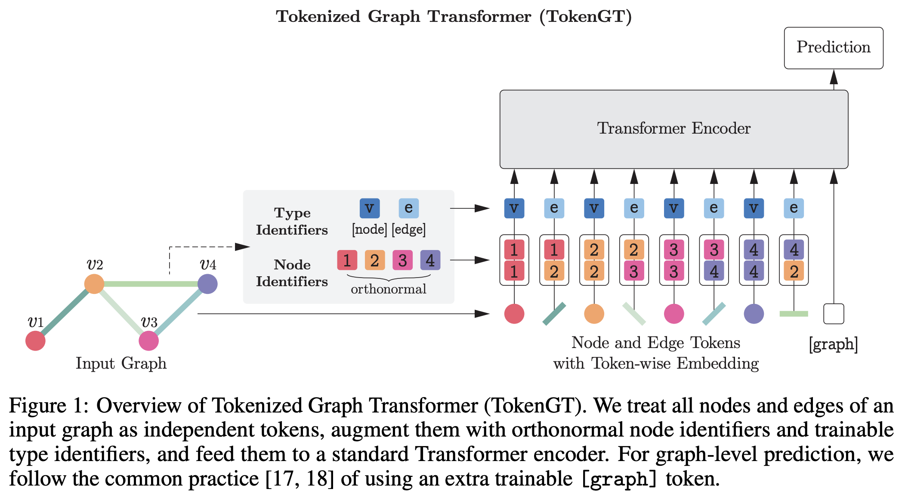

# Tokenized Graph Transformer - Official PyTorch Implementation

[**Pure Transformers are Powerful Graph Learners**](https://arxiv.org/abs/2207.02505) \
[Jinwoo Kim](https://bit.ly/3pPuyIb), [Tien Dat Nguyen](https://github.com/tiendatnguyen-vision), [Seonwoo Min](https://scholar.google.co.kr/citations?user=dWKk68wAAAAJ&hl=en), [Sungjun Cho](https://scholar.google.com/citations?user=bEilQPMAAAAJ&hl=en), [Moontae Lee](https://moontae.people.uic.edu/), [Honglak Lee](https://web.eecs.umich.edu/~honglak/), [Seunghoon Hong](https://maga33.github.io/) \
arXiv Preprint



## Setting up experiments
Using the provided Docker image (recommended)
```bash
docker pull jw9730/tokengt:latest
docker run -it --gpus=all --ipc=host --name=tokengt -v /home:/home jw9730/tokengt:latest bash
# upon completion, you should be at /tokengt inside the container
```

Using the provided ```Dockerfile```
```bash
git clone --recursive https://github.com/jw9730/tokengt.git /tokengt
cd tokengt
docker build --no-cache --tag tokengt:latest .
docker run -it --gpus all --ipc=host --name=tokengt -v /home:/home tokengt:latest bash
# upon completion, you should be at /tokengt inside the container
```

Using ```pip```
```bash
sudo apt-get update
sudo apt-get install python3.9
git clone --recursive https://github.com/jw9730/tokengt.git tokengt
cd tokengt
bash install.sh
```

## Running experiments

PCQM4Mv2 large-scale graph regression
```bash
cd large-scale-regression/scripts

# TokenGT (ORF)
bash pcqv2-orf.sh

# TokenGT (Lap)
bash pcqv2-lap.sh

# TokenGT (Lap) + Performer
bash pcqv2-lap-performer-finetune.sh

# TokenGT (ablated)
bash pcqv2-ablated.sh

# Attention distance plot for TokenGT (ORF)
bash visualize-pcqv2-orf.sh

# Attention distance plot for TokenGT (Lap)
bash visualize-pcqv2-lap.sh
```

## Pre-Trained Models
We provide checkpoints of ```TokenGT (ORF)``` and ```TokenGT (Lap)```, both trained with PCQM4Mv2.
Please download ```ckpts.zip``` from [this link](https://drive.google.com/drive/folders/1mo0dV-aLxGFWbPF8xfE8phWTmOtIV1HG?usp=sharing).
Then, unzip ```ckpts``` and place it in the ```large-scale-regression/scripts``` directory, so that each trained checkpoint is located at ```large-scale-regression/scripts/ckpts/pcqv2-tokengt-[NODE_IDENTIFIER]-trained/checkpoint_best.pt```.
After that, you can resume the training from these checkpoints by adding the option ```--pretrained-model-name pcqv2-tokengt-[NODE_IDENTIFIER]-trained``` to the training scripts.

## References
Our implementation uses code from the following repositories:
- [Performer](https://github.com/lucidrains/performer-pytorch.git) for FAVOR+ attention kernel
- [Graph Transformer](https://github.com/graphdeeplearning/graphtransformer.git), [SignNet](https://github.com/cptq/SignNet-BasisNet.git), and [SAN](https://github.com/DevinKreuzer/SAN/blob/main/data/molecules.py) for Laplacian eigenvectors
- [Graphormer](https://github.com/microsoft/Graphormer.git) for PCQM4Mv2 experiment pipeline
- [timm](https://github.com/rwightman/pytorch-image-models/blob/master/timm/models/layers/drop.py) for stochastic depth regularization

## Citation
If you find our work useful, please consider citing it:

```bib
@article{kim2021transformers,
  author    = {Jinwoo Kim and Tien Dat Nguyen and Seonwoo Min and Sungjun Cho and Moontae Lee and Honglak Lee and Seunghoon Hong},
  title     = {Pure Transformers are Powerful Graph Learners},
  journal   = {arXiv},
  volume    = {abs/2207.02505},
  year      = {2022},
  url       = {https://arxiv.org/abs/2207.02505}
}
```
